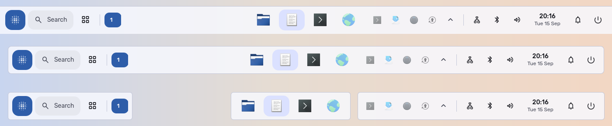
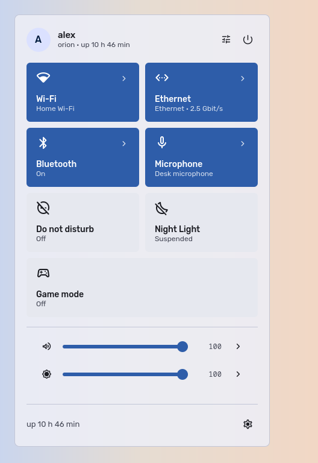
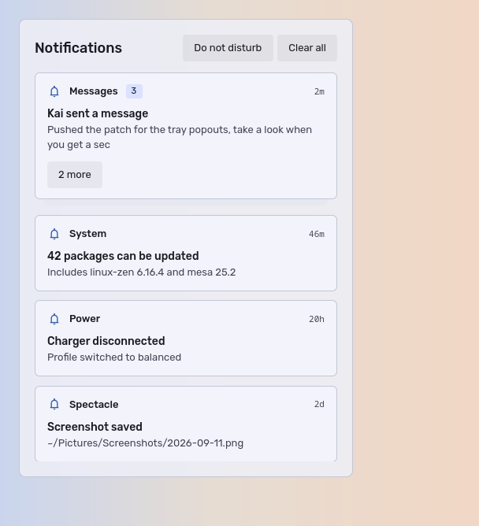
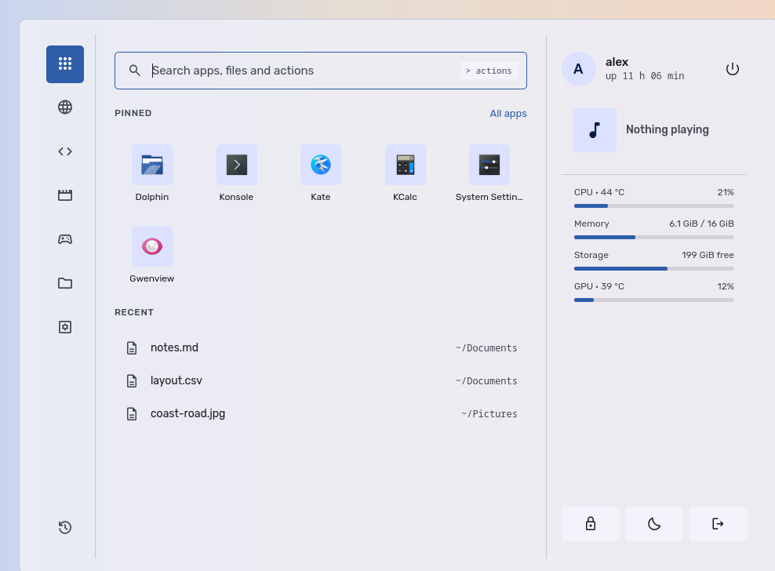
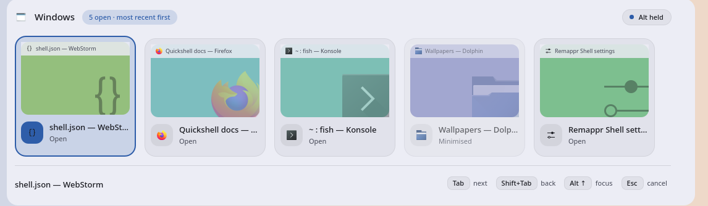
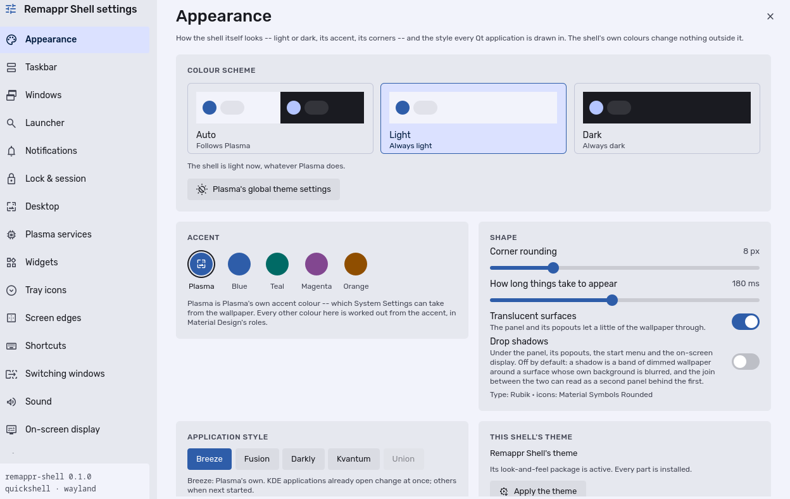
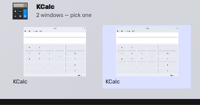

# Remappr Shell

A configurable, themeable desktop shell for KDE Plasma 6.

**This is not a Hyprland alternative.** Plasma already has a notification daemon, an OSD,
a lock screen, a wallpaper engine, an overview and a task switcher. Remappr Shell's job is
to draw a good panel, *retheme* Plasma's own components, and *expose* Plasma's settings —
not to replace subsystems that already work. Every replacement is opt-in and never the
default.



> Status: it draws the author's desktop, every day, from login. It is not packaged, it has
> had no users but its author, and it is version 0.1.0 for a reason — but "does it work"
> and "is it finished" are different questions, and the answer to the first is yes.

## What it does

- **One panel, two renderers.** A Quickshell layer-shell panel (default, total visual
  freedom) or a native Plasma panel generated from the same configuration — selectable in
  settings, and mutually exclusive so two panels can never overlap. Along any edge, as a
  strip, a floating bar or islands, with auto-hide.
- **Twenty-three widgets**, each declaring what it is rather than being special-cased by
  the panel: the taskbar, the tray, the launcher and search, the clock, workspaces, quick
  settings, volume, brightness, network, Bluetooth, battery, media, the clipboard, the
  recording indicator, and more. Drop a directory with a `widget.json` and a QML file into
  the widgets path and the panel hosts it; no core code changes.
- **Real window previews.** The taskbar's hover card, the desktop overview and this
  shell's own Alt+Tab draw live pictures of the windows, through KWin's screencast
  protocol.
- **Pluggable launcher and search.** Kickoff, KRunner, a built-in launcher, or any launcher
  of your own (rofi, fuzzel, wofi...) as a custom command, chosen at runtime.
- **Configurable everywhere.** A sparse JSON config with live reload, layered as
  defaults → profile → per-monitor, plus an in-shell settings GUI generated from the
  schema — so a new setting is a schema entry, not a page.
- **Reversible.** Every change to KDE configuration is recorded in a ledger with its prior
  value, and `rmpr restore` puts it back. Restore points are never deleted automatically.

## What it looks like

These are rendered from the components themselves, offscreen, by
`dev/preview/readme-shots.sh` — so a picture here cannot show something the shell does
not do, and re-taking them after a change is one command. None of them is a photograph
of anybody's desktop: the account, the network, the windows, the tray and the
configuration are all invented, which is what `PREVIEW_DEMO=1` is for.

The one exception is the last, and it says why underneath it.

| Quick settings | The notification centre |
| --- | --- |
|  |  |

Quick settings has a page behind every tile and every slider: the networks, the paired
devices, the outputs and inputs to pick between, a brightness slider per display. Which
tiles it draws is a setting.



The built-in start menu: pinned applications, recent files, what is playing, what the
machine is doing, and a search that also runs actions. It is one of four launchers the
shell can open — Kickoff, KRunner or a command of your own are the others, chosen at
runtime.



Alt+Tab, in three layouts. This one is a KWin switcher package rather than part of the
shell, which is what lets KWin draw it with its own live thumbnails where the coloured
panels are here.



Every page of the settings window is generated from `config/schema/shell.json` and the
widget manifests. Nothing in it is hand-laid-out, and
[`docs/config.md`](docs/config.md) is generated from the same file, so the window, the
reference and the shell cannot disagree about what a setting is.



An application with several windows shows a picture of each, and each one is a target.
This is the one real screenshot here, because a picture of a window needs a compositor
and there is none offscreen — the windows in it were opened for the photograph.

## Requirements

- KDE Plasma 6, Wayland
- `quickshell`, `qt6-declarative`, `jq`

## Installing it

One line, on a machine running Plasma 6 on Wayland:

```bash
curl -fsSL https://raw.githubusercontent.com/Wolffyx/remapprShell/main/install.sh | bash
```

It fetches the source into the shell's data directory, installs what the
distribution has to provide, and starts the guided setup below. Arch and its
family (CachyOS, EndeavourOS, Manjaro), Fedora and Ubuntu are known to it;
Quickshell comes from the distribution on Arch, from the
`errornointernet/quickshell` COPR on Fedora and from the
`avengemedia/danklinux` PPA on Ubuntu, each added only when Quickshell is
missing. Anything else is told which packages to install first.

```bash
curl -fsSL .../install.sh | bash -s -- --channel dev   # follow dev instead of releases
curl -fsSL .../install.sh | bash -s -- --yes           # ask nothing, take every default
```

Run again, it brings the same source up to date and sets up again;
`rmpr update` does the same without the questions. When it finishes the shell
is running, drawing the panel, and starts at login -- there is nothing left to
run by hand.

From a checkout of your own, the guided install on its own:

```bash
make setup          # the guided install: every choice asked once, then applied
```

One pass over everything an install decides -- the packages it needs, the restore
point, whether the files are copied or symlinked, what draws the panel, the window
list the taskbar reads, the window previews (built, with the compiler and Qt
development files they need), which keys this shell takes, who switches windows,
the look and feel, and whether it starts at login. Each step runs
the command you would otherwise run by hand (`install.sh`, `renderer set`,
`theme apply`, `shortcuts set`, `switcher use`), so the guided path and the manual
one cannot drift apart.

Nothing is written until the summary is confirmed: the questions come first, the plan
is shown, and one answer applies it. A restore point is taken before the first change,
and `rmpr restore` undoes the lot.

It asks in whatever front end the machine has -- KDE's own dialogs in a graphical
session, `whiptail` in a terminal, numbered prompts when there is neither, and none
at all when nobody is attached:

```bash
rmpr setup --dry-run        # the plan, and the commands it would run
rmpr setup --unattended     # ask nothing, take every default
rmpr setup --ui whiptail    # kdialog | whiptail | dialog | plain | none
rmpr setup --no-snapshot    # skip the restore point (not advised)
rmpr setup --no-preflight   # skip the machine check
```

The defaults are the setup this project is developed against: the files copied, this
shell drawing the panel, `Meta` for the application menu and `Meta+Space` for search,
Alt+Tab left with KWin drawing our switcher layout, the look and feel applied, and the
user service enabled so it starts at login. A key another shell already holds is taken
from it and said so; `rmpr shortcuts revert` gives it back.

## Removing it

```bash
rmpr uninstall              # Plasma's own panel, keys, Alt+Tab and look back; the shell's files gone
rmpr uninstall --purge      # and your settings, restore points and the fetched source with them
rmpr uninstall --dry-run    # what it would do
```

Each change is undone by the script that made it, from what it recorded -- so
what comes back is what was there, key by key, and nothing another program
changed since is overwritten. Your settings and restore points stay unless
`--purge` says otherwise, so a reinstall picks up where you left off. Packages
are left installed: jq, git and Qt are not this shell's to remove. Log out and
back in afterwards.

`rmpr restore --preinstall` is the blunter way back: whole files as they were
before the first install.

## Reinstalling it

```bash
rmpr reinstall              # uninstall, then the guided setup again
rmpr reinstall --yes        # the same, taking every default
rmpr reinstall --fresh      # and start from no settings (restore points are kept)
curl -fsSL .../install.sh | bash -s -- --reinstall        # the latest source first
```

The uninstall and the setup, run in turn, from the source already here -- or,
through the one-line install, from the latest one. It ends with the shell
running, as an install does. The setup's questions come after the uninstall,
so answering no at its summary leaves the shell uninstalled; it says so, and
how to finish.

## Development

```bash
make link     # symlink into ~/.config/quickshell/<slug>; most edits reload live,
              # a widget's own files need `rmpr reload`
make run      # run in the foreground against the working tree
make lint     # slug, layer and QML lints
make test     # QML tests, plus shell tests in a throwaway HOME
make uninstall  # the whole uninstall, as `rmpr uninstall`
make reinstall  # uninstall, then set up again from this tree
```

`make help` lists every target.

### Pictures

```bash
dev/preview/preview.sh <target.qml> <out.png> [w] [h] [light|dark]
dev/preview/readme-shots.sh          # the pictures above, again
```

`preview.sh` renders any QML offscreen against a copy of the worktree's shell: no
compositor, no display, nothing reaching the real session. It is how a page is looked at
while it is being built, and it is where the README's pictures come from.

`PREVIEW_DEMO=1` gives the shot a plausible stranger: an account and a host, a network,
a sound card, five invented windows of four applications, a tray of four generic icons,
and an empty configuration directory so the picture shows the shipped defaults rather
than whatever this machine has pinned and rearranged. A published screenshot should not
carry whoever took it, and the pictures should be re-takeable on a machine that is not
this one. Every substitution is checked, because a silent miss would leave a picture
that looks right and still has a real name in it.

### Command line

```bash
rmpr setup              # the guided install (see above)
rmpr preflight          # what would change, and whether this machine is ready
rmpr snapshot create    # take a restore point now
rmpr snapshot list      # what exists, with sizes
rmpr restore            # put KDE back the way it was
rmpr theme apply        # install and activate the look and feel
rmpr renderer list      # what can draw the panel here
rmpr renderer set plasma --dry-run   # the applet layout it would install
rmpr renderer set plasma             # switch, with a restore point and a rollback
rmpr wizard             # re-run the first-run wizard (it keeps the profile it replaces)
rmpr profile list       # configuration profiles, and which is active
rmpr preset apply <n>   # a whole panel layout, keeping what it replaces
rmpr windows enable     # the open-window list (opt-in; see below)
rmpr settings [page]    # the settings window
rmpr doctor             # check everything and report fixes
rmpr report create      # write a local diagnostic bundle
rmpr report show        # read the newest one
rmpr lockscreen status  # which lock screen the next lock will draw
rmpr status
```

### Configuring it

[`docs/config.md`](docs/config.md) is the full reference: every setting, its
type, its default and what it means, plus each widget's own options. It is
generated from `config/schema/shell.json` and the widget manifests, and
`make lint` fails if it has drifted from them -- a configuration reference that
is quietly wrong is worse than none, because it is trusted.

### Working on the panel's popouts

[`docs/popouts.md`](docs/popouts.md) is how one is built: the four files, what
a widget declares, where each thing on screen comes from, how a popout is
placed and closed, and how to look at one -- including which of the two ways
to look at one will lie to you.

### Working on the settings window

[`docs/settings.md`](docs/settings.md) is how a page is built: the parts, what
the schema decides on its own, where a control goes and why, and how to render a
page offscreen and look at it.

### The theme layer

`rmpr theme apply` installs a Look-and-Feel package (our OSD, splash and logout
screens), two colour schemes, a window-switcher package for Alt+Tab, and a
desktop theme, then activates the package. It does **not** select any of them:
installed but unselected, a colour scheme or a switcher changes nothing, and
they appear in System Settings for you to try. `--appearance` is what selects
them, and `rmpr theme revert` puts every key back and removes every file we
installed -- leaving anything you put in those directories yourself alone.

`theme.mode: auto` turns the shell light by day and dark by night, on KWin's
Night Light schedule. The applications follow only if you ask them to: turn on
**Applications follow day and night** (`theme.desktop.followMode`) and the
shell rewrites KDE's colour scheme and icon theme when night falls, or run
`rmpr theme variant light|dark|auto` to do it once by hand. `rmpr theme
variant` with no argument says what is resolved and from what. Every key it
writes is ledgered like the rest, so `rmpr theme revert` still puts the desktop
back.

The colour schemes are generated from `theme/colors/palette.json`, and the
desktop theme ships the same file, so Plasma's widgets, its dialogues and our
panel cannot disagree about what the accent colour is. The desktop theme
provides colours only: every SVG it does not carry falls back to Breeze's, so
it is a recolour rather than a second set of assets to maintain.

### The open-window list

KWin implements `org_kde_plasma_window_management` and not
`zwlr_foreign_toplevel_manager_v1`, so Quickshell's own toplevel API sees
nothing here. KWin's scripting API is the supported way in, and a KWin script
can *call* DBus but never be called -- while Quickshell cannot own a DBus name.
So there is a small daemon in between:

```
KWin script  --Update-->  windowsd  --Changed-->  the shell
                                    <--List--
```

The daemon is started by the bus the first time anything calls it, holds the
list, and does nothing else. Clicking a window goes the other way entirely,
straight to KWin's own `/WindowsRunner`, which is a supported interface -- so
nothing of ours sits in the activation path.

All of it is opt-in:

```bash
rmpr windows enable    # install and load the KWin script
rmpr windows show      # what it currently sees
rmpr windows disable   # unload it and put kwinrc back
```

Then add the **Open windows** widget to the panel. `rmpr doctor` reports the
widget being present without the list being on, and the reverse.

### The on-screen display

Plasma draws the volume and brightness popup, and that is the default. Ours is
opt-in and takes nothing over: `plasmashell` emits `osdProgress` and `osdText`
on `org.kde.osdService` as plain DBus signals, so the shell listens and draws.
Turn it off and Plasma is exactly as it was.

With our Look-and-Feel package active, Plasma draws *our* OSD QML, so enabling
ours without silencing that shows two. One command settles both:

```bash
rmpr theme osd ours     # the shell draws it; Plasma's is silenced
rmpr theme osd plasma   # back to Plasma's
```

`rmpr doctor` reports the combination that would show two, and the one that
would show none.

### The lock screen

Plasma's greeter locks the screen, checks the password and draws the lock
screen; that stays the default. Ours is only the drawing -- a clock over the
wallpaper, and at a key the prompt, on a blurred copy of it -- and it is off
until you have unlocked it yourself:

```bash
rmpr lockscreen try       # shows it for real; unlock it with your password
rmpr lockscreen enable    # only after a successful try of this exact build
rmpr lockscreen disable   # Plasma's again from the next lock
```

`try` covers the screens and takes the keyboard exactly as a lock does, but
locks nothing, and closes by itself after 90 seconds if it is not unlocked.
The greeter's own exit status is the test: it ends successfully only once the
password was right. `enable` installs the copy that was tried, and asks for a
new try after a kscreenlocker update. `enable` also prints the way back, for
the case that matters: from a text console (Ctrl+Alt+F3),
`loginctl unlock-session <id>`, then `rmpr lockscreen disable`, which needs no
desktop to run.

It comes in twelve styles, picked on the settings window's Lock page or with
`rmpr lockscreen set style <name>`: glass (the default), editorial, console,
ambient, board, poster, seats, minimal, dayahead, secure, accessible and kiosk.
Every one draws the same few things over itself: a countdown while PAM has the
account locked out, a battery running out (a pill, then a banner, then a
minute's countdown to hibernating -- `set hibernateAt 0` leaves that to
Plasma), the screen dimming to a clock after `set dim <seconds>`, and the
shutter lifting on the way out (`set unlockAnimation false` for none). `set
accent` picks the one colour they all share. Nothing a lock screen cannot know
is drawn -- no weather, calendar or notifications: the greeter is a separate,
sandboxed program with none of the session's memory. `rmpr lockscreen check
--all` loads every style in the real greeter.

Plasma 6 reads the lock screen from the shell package plasmashell is on, so
ours lives in this project's own shell packages, and no KDE setting is
written. `rmpr lockscreen check` loads it in Plasma's real greeter, offscreen
and without touching your session, and `make test` runs it.

### Diagnostic reports

`rmpr report` writes a bundle of four things to
`~/.local/state/<slug>/diagnostics/<ts>/`: the error and what `qmllint` makes of
the file it came from, versions and environment, the merged configuration, and a
journal tail with widget health.

**Nothing is sent anywhere.** A report is a directory of text files; every
consumer of one is separate and opt-in.

The configuration and the journal tail go through a redaction pass first: the
home directory becomes `~`, the username becomes `<user>` wherever it appears,
and any value whose key matches `token|key|password|secret|auth` is masked
outright. That pattern deliberately over-reaches -- it masks `keyboardLayout`
too -- because a report that withholds something harmless costs a question,
while one that leaks a token cannot be taken back. The rules exist twice, in
QML for the running shell and in shell for the crash reporter that has to work
when the shell is dead, and both are held to one fixture corpus so they cannot
drift apart.

The shell's systemd unit carries `OnFailure=`, so a report is written precisely
when the shell dies. A widget being quarantined writes one through the same
command.

### Updating

```bash
rmpr update --check          # what an update would bring
rmpr update                  # from the configured git remote
rmpr update --from ~/src/x   # from a local checkout
rmpr update --rollback       # back to where it was
```

Both sources run the same pipeline -- preflight, restore point, apply, check
migrations exist, verify, install, restart -- and it returns to the previous
state if any step fails. A local install that skipped verification would mean
the path most used during development is the one least tested.

An update refuses to start if the checkout has uncommitted changes, and a
version that fails its own QML lint is rolled back rather than installed.

### Restore points are never deleted automatically

Not on restore, not on uninstall, not to reclaim space, not to prune old ones.
A restore point the software may delete by itself is not a restore point, and
an early version of the restore code proved the point by deleting its own
archive mid-restore and taking a user's configuration with it.

They are removed only when asked:

```bash
rmpr snapshot remove <name>   # delete one, after confirming
rmpr snapshot prune --keep 5  # delete all but the newest N, after confirming
```

Both prompt first. Every delete path in the codebase goes through a guard that
refuses to touch anything inside the snapshot store, so the rule holds even if
a future call site forgets it.

### Changing KDE settings

Every key this project writes is recorded with its prior state first, including
whether the key existed at all, so `revert` restores exactly what was there.
Anything outside `scripts/lib/protected.sh` is never touched, and restore never
deletes a file it did not create -- a restore that leaves an extra file behind
is a nuisance, one that deletes the wrong file is not recoverable.

Destructive code is tested against a throwaway `HOME`, never a real one.

### Project name

The name is a variable, not a constant. `branding.json` is the only place it exists;
`shell/core/Branding.qml` is generated from it and `scripts/lint-slug.sh` fails the build if
the slug is hardcoded anywhere else.

### Code layout

A strict dependency ladder, enforced by `scripts/lint-layers.sh`. A layer may import from
layers below it, never sideways and never up.

| Layer | May import | Contains |
| --- | --- | --- |
| `core/` | — | primitives with no dependencies |
| `platform/` | core | KDE, Wayland and system integration |
| `domain/` | core, platform | headless logic, no visuals |
| `ui/` | core, platform, domain | presentation only, no side effects |
| `features/` | all of the above | self-contained vertical slices |

## Licence

GPL-3.0-or-later. See [LICENSE](LICENSE).

This project is written from scratch. It takes no code from other shells.
